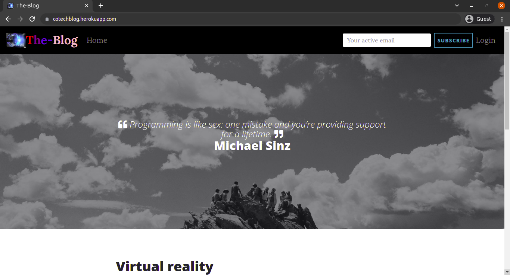

# The-Blog
#### This is a python-flask application on a blog site that users can view and even comment on various blogs. Consumes API for random quotes

<br>
 
 ***Monday November 15 2021*** 
####  By **OMOLO LEVY**&trade;


## Project Description
This is a python-flask application on a blog site that users can view and even comment on various blogs. Allows writers to create blogs and post or share them. It consumes an API to generate a random quotes that users can read.
</br>

With this app, a user is able to :
* View the blog posts on the site.
* Comment on blog posts.
* View the most recent posts. 
* Receive an email alert when a new post is made by joining a subscription.
* See random quotes on the site.

With this app, a writer is also able to :
* Sign in to the blog.
* Create a blog from the application.
* Delete comments that I find insulting or degrading.
* Update or delete blogs I have created.


## Project live sites
  * This is the live [link to the repo ](https://github.com/omololevy/The-Blog) <br>
  * This is the live [link to the app ](https://cotechblog.herokuapp.com/)


## Homepage Demo
The app looks like this: 
  

## Setup instructions
* Create a virtual environment in your project directory through the terminal with the command: <br>
```$ python3.9 -m venv --without-pip virtual```

* Activate the virtual environment:<br>
```$ source virtual/bin/activate ```

* Install pip for installing other necessary python packages:<br>
```$ curl https://bootstrap.pypa.io/get-pip.py | python```

* Install flask module:<br>
```$ pip install flask```

* Clone the program from the [online repo](https://github.com/omololevy/The-Blog)
* Click on the <button style="background-color:green;"><a href= "https://github.com/omololevy/The-Blog" style= "color:white">code</a> </button> button to clone or download

## The App Structure
~~~
|-The-Blog
    |-app/
        |-auth/
            |-__init__.py
            |-forms.py
            |-views.py
        |-main/
            |-__init__.py
            |-errors.py
            |-forms.py
            |-views.py
        |-static/
            |-css/
            |-favicon/
            |-fonts/
            |-js/
            |-photos/
        |-templates/
            |-auth/
                |-login.html
                |-signup.html
            |-email/
                |-notification.html
                |-notification.txt
                |-welcome.html
                |-welcome.txt
            |-profile/
                |-profile.html
                |-update.html
            |-base.html
            |-edit_post.html
            |-fourOwfour.html
            |-index.html
            |-posts.html
            |-new_posts.html
            |-navbar.html
        |-__init__.py
        |-email.py
        |-models.py
        |-requests.py
    |-migrations/
    |-tests/
        |-test_comments.py
        |-test_post.py
        |-test_quote.py
        |-test_user.py
    |-virtual/
    |-config.py
    |-.gitignore
    |-LICENSE
    |-manage.py
    |-Procfile
    |-README.md
    |-requirements.txt
    |-start.sh
~~~
## Deployment
* ```$ heroku login```
* ```$ heroku create <name-of-app>```
* ```$ heroku config:set MAIL_USERNAME=<YOUR EMAIL ADDRESS>```
* ```$ heroku config:set MAIL_PASSWORD=<YOUR EMAIL PASSWORD>```
* ```$ heroku addons:create heroku-postgresql```
* ```$ git push heroku master```

## Database Migration
* ```$ heroku run python3.9 manage.py db stamp head```
* ```$ heroku run python3.9 manage.py db migrate```
* ```$ heroku run python3.9 manage.py db upgrade```

## Technologies Used
* Python3.9.5
* HTML
* CSS
* Bootstrap
* Flask1.1.4

## Pending Issues

* You can make a [pull request](https://github.com/omololevy/The-Blog/pulls) to this repo improve it or adjust any functionalities.

## Support and contact details
Contact me omololevy@gmail.com
### License
The project is under [MIT LICENSE](https://github.com/omololevy/The-Blog/blob/master/LICENSE) 
Copyright &copy; 2021.All rights reserved
  